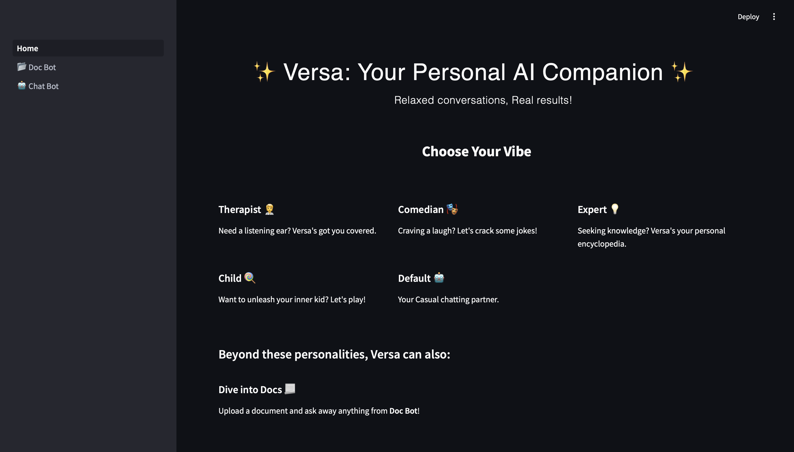
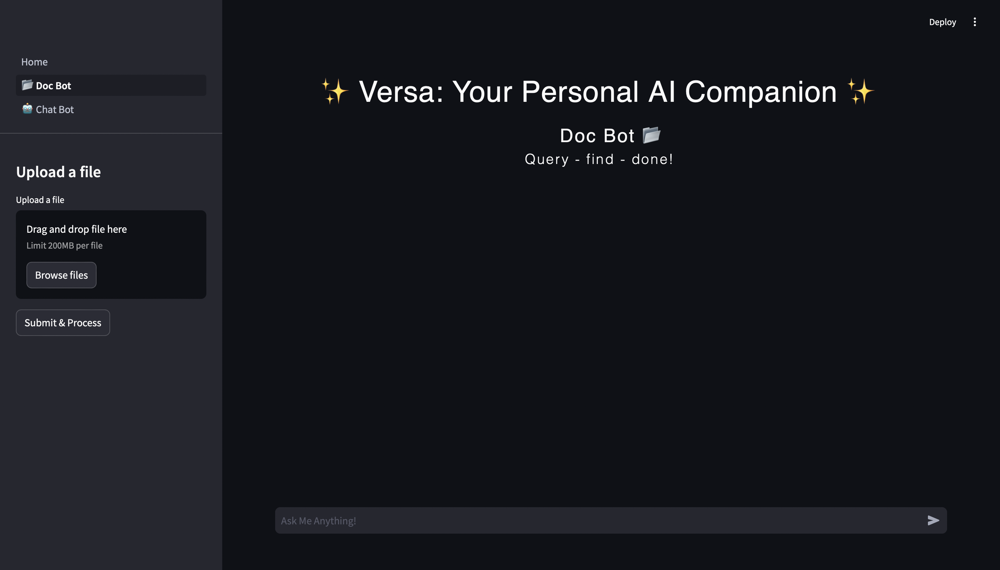
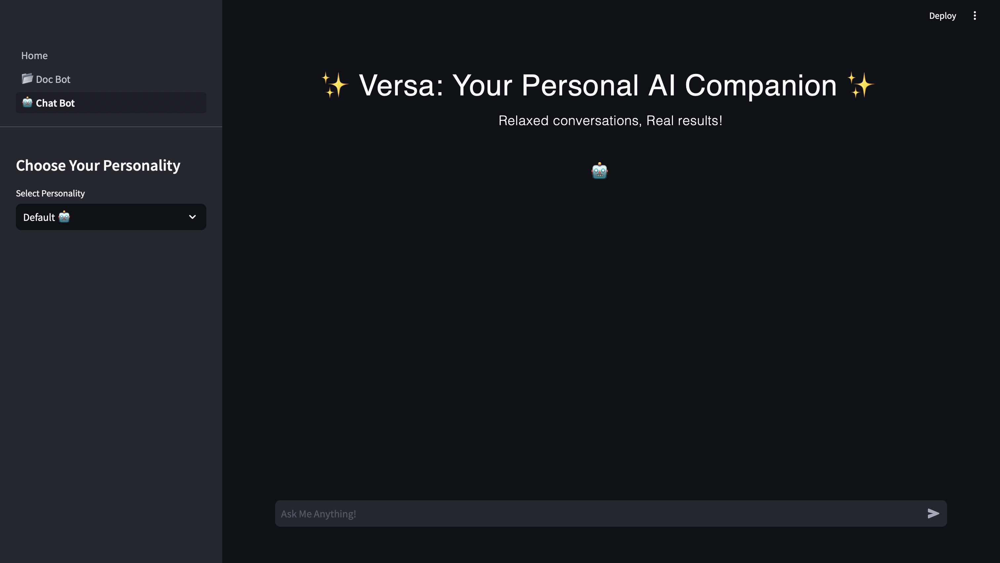

## ✨ Versa: Your Personal AI Companion ✨

### Relaxed conversations, Real results!

#### Overview

This package houses the Streamlit-based application for Versa, a versatile chatbot offering diverse personalities and functionalities.

**Getting Started**

**Run the app:**
To run the module as a script, navigate to the root folder and run:
   ```bash
   python -m streamlit run chatbot/streamlit/Home.py
   ```

### Features

* **What's your mood?**  Choose from a variety of personalities under **Chat Bot**:
  * **Therapist 🧑‍⚕️:** Offers emotional support and guidance.
  * **Comedian 🎭:** Delivers witty banter and humor.
  * **Expert 💡:** Provides information and answers queries.
  * **Child 🍭:** Engages in playful and innocent conversation.
  * **Default 🤖:** Offers casual conversation.
* **Other than this, there is DocBot 📂:** Upload a document and ask away!.

### Usage
Simply select your desired personality and start chatting!

### Glimpse of Versa app

**Versa's Home Page**


**Versa's Doc Bot**


**Versa's Chat Bot**


### License
This project is licensed under the GNU Affero General Public License (AGPL) (see it here - [LICENSE](../../LICENSE) ).
